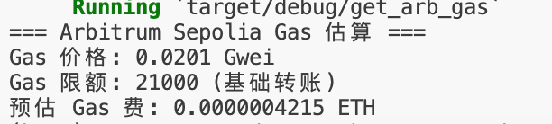

# Task 1 - ethers-rs 实战练习

## 关卡 1：计算 Arbitrum 转账 Gas 费

**代码路径：** [`level1-gas-calculator/`](./level1-gas-calculator/)

**运行结果：**

---

## 关卡 2：连接 Arbitrum 测试网

**代码路径：** [`level2-connect-testnet/`](./level2-connect-testnet/)

**运行结果：**

---

## 关卡 3：查询测试币余额

**代码路径：** [`level3-query-balance/`](./level3-query-balance/)

**运行结果：**

